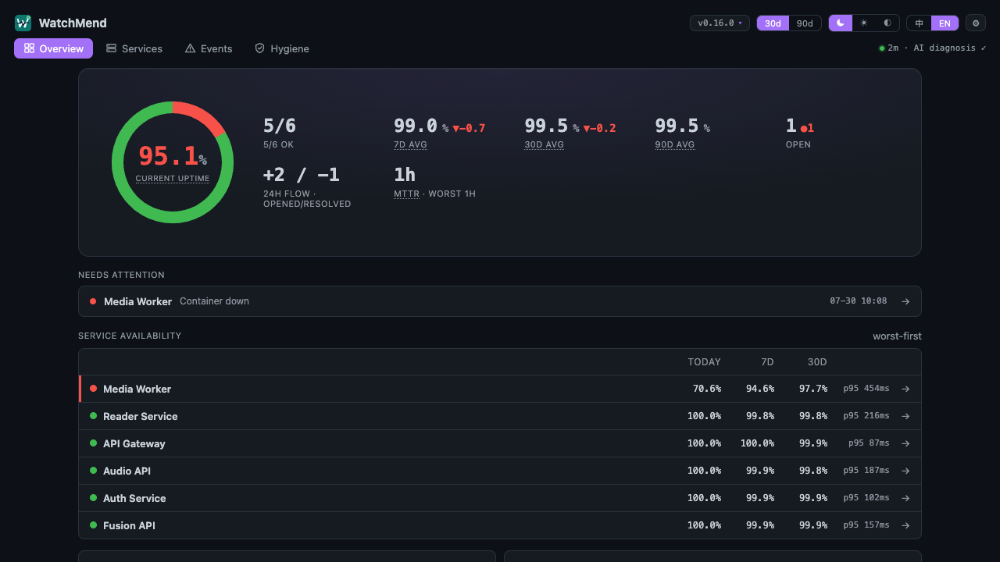
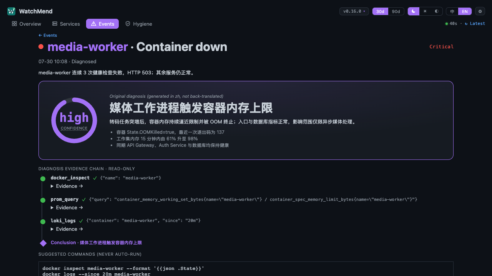

# WatchMend

> 盯着你的服务器,出事先查明白,再来叫你。

[English](README.en.md) · MIT License · Python 3.12+ · 单容器 · SQLite

WatchMend 是一个面向个人服务器、Homelab 和小团队的 AI 运维哨兵。它把 HTTP 探针、
Docker、Prometheus、Loki 和上游状态页统一成**带触发、调查、恢复和冷却的事件生命周期**，
再通过实时告警或分时摘要把真正需要处理的内容交给你。

- **确定性规则决定是否告警**：LLM 永不负责把严重事故判成“无需处理”。
- **LLM 可选且全程只读**：用于根因调查、状态解释和非紧急消息降噪，不执行修复命令。
- **证据面板可追溯**：实时服务健康、事故时间线、调查工具与原始证据都能展开查看。
- **通知不锁平台**：飞书提供原生富卡片，同时支持 Telegram、ntfy 和通用 webhook。

所有能力都可独立启停、配置缺失时安全降级。最小可跑面是 Docker 加任意一个通知渠道。

```
HTTP / Docker / Prometheus / Loki / 上游状态页
                         │
                         ▼
         确定性规则 → 事件机（冷却 / 恢复 / 基线）
                         │
             ┌───────────┴───────────┐
             ▼                       ▼
  严重事故实时通知          非紧急事件 09:00 / 18:00 摘要
             │                       │
             └───────────┬───────────┘
                         ▼
       只读 LLM 调查（可选）+ 实时证据面板
                         │
                         ▼
      飞书富卡片 / Telegram / ntfy / webhook
```

## 产品截图

> 以下均为合成演示数据，不包含真实服务器名称、日志或事故信息。



<p align="center"><sub>实时健康度、开放事件、近期趋势与按风险排序的服务可用率</sub></p>



<p align="center"><sub>LLM 根因结论、置信度、只读工具调用证据与永不自动执行的建议命令</sub></p>

## 5 分钟 demo

自带 prometheus / loki / cadvisor / node-exporter 和一个示例服务,零外部依赖:

```bash
git clone https://github.com/HyxiaoGe/watchmend && cd watchmend
make demo          # 首次会生成 .env 并停下来,填一个飞书群机器人 webhook 后再跑一次
```

起来后干掉示例服务看告警卡:

```bash
docker compose -f docker-compose.demo.yml stop demo-app   # ~15 分钟后收到事件卡
docker compose -f docker-compose.demo.yml start demo-app  # 之后会收到 ✅ 恢复卡
```

## 正式部署

```bash
cp .env.example .env                      # 按注释填:至少一个通知渠道,其余按需
cp services.example.yaml services.yaml    # 改成你自己的服务探针清单
make up                                   # 或 docker compose up -d --build
```

接入点大多可选、留空即关、各层独立(docker 层例外,见表末):

| 配置 | 启用的能力 | 留空时 |
|---|---|---|
| `FEISHU_VENDOR_WEBHOOK` | 告警/日报飞书卡片 | 该渠道关闭 |
| `SENTINEL_TELEGRAM_BOT_TOKEN` + `SENTINEL_TELEGRAM_CHAT_ID` | Telegram 推送(两者都填才启用) | 该渠道关闭 |
| `SENTINEL_NTFY_URL`(可选 `SENTINEL_NTFY_TOKEN`) | ntfy 推送,完整 topic URL | 该渠道关闭 |
| `SENTINEL_WEBHOOK_URL`(可选 `SENTINEL_WEBHOOK_TOKEN`) | 通用 webhook,结构化 JSON | 该渠道关闭 |
| `SENTINEL_CODEX_INGEST_TOKEN` | Codex 生命周期通知入口 | 入口返回 404、保持关闭 |
| `services.yaml` | 内部服务 HTTP 探针 + 延迟基线(每项可选 `label` 设面板显示名) | 只监控外部状态页 |
| `SENTINEL_PROMETHEUS_URL` | 磁盘/内存/容器重启等指标规则 | 指标层关闭 |
| `SENTINEL_LOKI_URL` | 错误日志激增检测 | 日志层关闭 |
| `SENTINEL_ERROR_ALERT_ENABLED` | 低频/单条错误指纹检测 | 默认关闭 |
| `SENTINEL_DEFER_NONURGENT` | 非硬告警并入 09:00/18:00 摘要 | 保持实时通知 |
| `SENTINEL_EDITOR_MODE` + 编辑器端点/模型 | LiteLLM 状态页解释与非紧急降噪 | 规则卡片原样发送 |
| `SENTINEL_RESTIC_BACKUP_MAX_AGE_HOURS` | Restic Pushgateway 成功时效检查 | 默认关闭 |
| `SENTINEL_MIDDLEWARE_METRICS` | pg/redis 等 exporter up 兜底 | 跳过该检查 |
| `SENTINEL_CERT_DOMAINS` | 公网证书临期检查 | 跳过该检查 |
| 备份目录挂载 | pg_dump 备份新鲜度检查 | 跳过该检查 |
| `LLM_BASE_URL` + `LLM_MODEL` | 事件根因诊断 + 日报 AI 总结 | LLM 层关闭 |
| `SENTINEL_DOCKER_HOST` | 容器停止/不健康/OOM/崩溃重启检测 + docker 诊断工具 | docker 层关闭 † |

> † 与其它层相反:docker 层**默认开启**——`docker-compose.yml` 预置了只读
> `docker-socket-proxy` 边车(`CONTAINERS=1`、POST 默认拒、专用 `internal` 网),
> 本容器**永不挂裸 socket**。要整层关闭:清空 `SENTINEL_DOCKER_HOST` 并注释掉 compose
> 里的 `docker-proxy` service 及 sentinel 的 `depends_on`/`docker_proxy` 网络(文件内有注释)。

> **通知渠道为广播模型**:配置的所有渠道并发收到每条告警/恢复/日报/诊断,失败相互隔离(任一渠道挂只记日志,不影响其余)。两类投递语义不同:**告警/恢复**走 **send-then-commit**——**≥1 个渠道投递成功才落库**(去重/冷却),全部失败则不落库、留待下一轮整体重发,保证瞬时故障不丢事件;**诊断/日报卡**是**「已落库后尽力推送」**——底层诊断结果/日报数据先持久化,卡片广播失败**不回滚**已落库记录(证据台仍可见)、也不重发。两类在单次广播内都**不对失败渠道做重试**。**至少配置一个渠道**(飞书 `FEISHU_VENDOR_WEBHOOK` 或上述任一)即可启动;`FEISHU_VENDOR_WEBHOOK` 不再强制必填,海外自托管可只配 Telegram/ntfy/webhook。

全部 40+ 配置项(阈值、冷却、播报粒度…)见 [.env.example](.env.example),每项带注释。

## 国内 / 镜像版部署(开箱即用)

如果你想直接拉 [ghcr](https://github.com/HyxiaoGe/watchmend/pkgs/container/watchmend) 上的预构建镜像(**不本地构建源码**)、机器上**没有**现成的 prometheus/loki/反向代理 docker 网络、或者你**在 GFW 后面**,走这条路径,而不是上面的 `make up`。它用一份自包含的 [`docker-compose.image.yml`](docker-compose.image.yml):镜像版(无 `build:`)、不挂外部 `egress`/`metrics` 网、docker 只读代理边车换成国内可达的同源 fork。

> 上面的 `## 正式部署`(`make up`)假设你能从源码构建、且有/愿意创建外部 docker 网络;这条路径把这些前置都去掉了。**仍需 clone 仓库**——跳过的是镜像构建,不是仓库(compose、`.env.example`、`services.example.yaml` 都在仓库里)。

**Step 0 — 装 Docker(国内,若未装)**:`curl -fsSL https://get.docker.com | sh -s -- --mirror Aliyun`(默认的 `get.docker.com` 在国内会卡在 download.docker.com 拉 GPG key 那步、`curl` exit 35)。

**步骤**:

```bash
# (a) 取仓库(只跳过镜像构建,仍需 clone 拿配置模板与 compose)
git clone https://github.com/HyxiaoGe/watchmend && cd watchmend

# (b) 至少填一个通知渠道
cp .env.example .env        # 编辑:FEISHU_VENDOR_WEBHOOK 或 Telegram/ntfy/webhook 任一

# (c) 探针清单
cp services.example.yaml services.yaml   # 改成你自己的服务;只盯外部状态页就把 services 改成 services: []

# (d) SQLite 落盘目录(不建会被 docker 创成 root 属主的空目录)
mkdir -p data

# (e) 起容器(注意 -f 指定这份 compose)
docker compose -f docker-compose.image.yml up -d

# (f) 验活
curl http://127.0.0.1:8765/health
```

> **务必填渠道**:这条路径不经 `make`,没有 Makefile 的渠道门禁。直接 `docker compose up` 时,`.env` 里**一个通知渠道都不填**,容器会**崩溃重启**——应用启动期会断言「至少配置一个渠道」,而 compose 的 `restart: unless-stopped` 会把这次启动异常变成无限重启(`/health` 永远起不来)。填了**语法合法但假的**值能起来(渠道只校验非空、不校验可达),见文末注意。

> **`services.yaml` 写法**:要监控内部服务就 `cp services.example.yaml services.yaml` 后改成你自己的清单;只盯外部状态页就把 `services` 块写成 `services: []`(最清晰直观)。裸 `services:` 键、空文件、缺文件都会**安全回落「仅外部状态页」模式**(不崩);只有真正格式坏(如某服务项缺 `name` 必填字段)才会响亮失败。

**镜像版本**:`docker-compose.image.yml` 里 `image:` 固定钉在某个具体版本(仓库策略不用 `:latest`)。读到这篇时它可能已过时——最新版见 [releases 页](https://github.com/HyxiaoGe/watchmend/releases),想升级就改 `image:` 那行的 tag 再 `docker compose -f docker-compose.image.yml up -d`。

**docker 只读巡检层(默认开)**:这份 compose 自带一个只读 socket 代理边车,但镜像换成了 `lscr.io/linuxserver/socket-proxy` 而非 `## 正式部署` 用的 `tecnativa/docker-socket-proxy`——后者只在 Docker Hub,**Hub 在国内被墙拉不动**;`lscr.io` 国内可达,且是同源 fork,环境变量接口(`CONTAINERS`/`POST`/`EVENTS`…,POST 默认 `0` = 只读)一致。两点注意:① 巡检按镜像名子串自动排除自带的 socket 代理(`tecnativa` 与 `lscr` fork 都覆盖),无需手动设 `SENTINEL_DOCKER_EXCLUDE`(仅当你换用名字不含上述子串的其它代理镜像时,才按容器名排除);② 不需要 docker 巡检就按文件内注释整段关掉,并清空 `.env` 的 `SENTINEL_DOCKER_HOST`(否则它默认连 `tcp://docker-proxy:2375`、连不上会每 60s 刷错误日志)。

**LLM 诊断**:这条路径**用 `.env` 的 `LLM_BASE_URL` / `LLM_API_KEY` / `LLM_MODEL` 启用**即可(填齐 `LLM_BASE_URL`+`LLM_MODEL` 就开)。国内首选 DeepSeek(`api.deepseek.com`)/ Moonshot 国内站(`api.moonshot.cn`);OpenAI / Anthropic / Gemini 直连在 GFW 后不可达,各平台 `base_url` 与地域备注见 [`## LLM 诊断(可选)`](#llm-诊断可选)。`llm.yaml` 注册表 + `make llm-init` 热加载那套是 `make up` 源码构建路径用的,这份 compose **刻意不挂 `llm.yaml`**(无 `make` 用户不会预置占位文件,直接挂会被 docker 创成同名空目录)。

**访问面板**:端口只绑在宿主机 `127.0.0.1`,**默认零公网暴露**。在机器本机直接开 `http://127.0.0.1:8765`;远程看面板走 SSH 隧道:

```bash
ssh -L 8765:127.0.0.1:8765 you@your-server   # 然后本地浏览器开 http://127.0.0.1:8765
```

> 面板与写 API 共用 `8765` 端口。**要对外暴露**(LAN 绑定 / 反向代理)**之前**,务必为所有启用的写 API 配好对应 Token(`openssl rand -hex 16`)；Codex 通知入口使用独立的 `SENTINEL_CODEX_INGEST_TOKEN`，留空时保持关闭——详见 [`## 证据台面板（只读）`](#证据台面板只读) 的安全说明。

> **注意一条**:渠道只校验非空、不校验可达,所以一个**语法合法但 token 写错**的 webhook 能通过启动门禁、容器照常运行,但日报/告警**投递会失败并每分钟重试刷日志**(如飞书 `code=19001 token invalid`)。起来后顺手核对一下渠道凭据。

## LLM 诊断(可选)

**不锁平台。** WatchMend 走标准 OpenAI `chat/completions` + function calling 协议,
任何提供 OpenAI 兼容端点的服务都即插即用。多家可共存,声明在 `llm.yaml` 里、`active`
指针选用,改了**下一轮诊断热加载生效、无需重启**:

```yaml
# llm.yaml(gitignored;见 llm.example.yaml)
active: deepseek       # 当前诊断器
fallback: kimi         # 可选:active 失败后再试一轮(事件诊断与日报 AI 总结都走)
providers:
  deepseek:
    base_url: https://api.deepseek.com/v1
    model: deepseek-chat
    api_key_env: LLM_API_KEY_DEEPSEEK   # 真 key 留在环境变量,不落盘
  kimi:
    base_url: https://api.moonshot.cn/v1
    model: kimi-k2-turbo-preview
    api_key_env: LLM_API_KEY_KIMI
```

```bash
make llm-init            # 交互向导,加一个 provider
make llm-switch name=kimi  # 切 active(下一轮生效,免重启)
make llm-list            # 看各 provider 与 key 是否就绪
```

> **Docker 部署**:`llm.yaml` 经 compose 挂进容器(`./llm.yaml:/app/llm.yaml:ro`),
> `make up`/`make demo` 会自动预置一个空占位;宿主机上 `make llm-init`(先加 provider)、
> `make llm-switch`(再切 active)改的就是容器读的同一份文件。**LLM 已启用后**,切 provider /
> 改 model 都**下一轮诊断热加载生效——无需进容器、无需重启**;但**首次**在空占位上从零启用
> 诊断仍需重启一次容器(诊断 job 在启动时按是否启用注册,见下条)。

> **向后兼容**:没有 `llm.yaml`(或它为空/纯注释,如 `make up` 预置的占位)时回落老三
> 环境变量 `LLM_BASE_URL`/`LLM_API_KEY`/`LLM_MODEL`(零 breaking)。坏配置一律 fail-safe:
> 启动时坏配置只关 LLM 层、确定性巡检照跑;运行中改坏 `llm.yaml` 保留上一份有效配置,
> 不打断监控。**首次从零启用 LLM 需重启一次**;之后切 provider/改 model 全走热加载。

| 平台 | `LLM_BASE_URL` | `LLM_MODEL` 示例 | 备注 |
|---|---|---|---|
| OpenAI | `https://api.openai.com/v1` | `gpt-5.5` | |
| DeepSeek | `https://api.deepseek.com/v1` | `deepseek-chat` | 本项目实测验证 |
| Moonshot / Kimi | `https://api.moonshot.cn/v1` | `kimi-k2` | 国际站用 `api.moonshot.ai/v1`,key 分区不通用 |
| 智谱 GLM | `https://open.bigmodel.cn/api/paas/v4` | `glm-4` | |
| Ollama(本地) | `http://localhost:11434/v1` | `qwen3` | key 随便填;选支持 tool calling 的模型 |
| vLLM(自建) | `http://<host>:8000/v1` | 你部署的模型 | 启动需加 `--enable-auto-tool-choice` 和 `--tool-call-parser` |
| Google Gemini | `https://generativelanguage.googleapis.com/v1beta/openai/` | `gemini-2.5-flash` | 兼容层 tool calling 受限;且有地域限制,部分地区(如中国大陆)直连报 `User location is not supported`,需经支持地域的网关 |
| Anthropic Claude | `https://api.anthropic.com/v1/` | `claude-opus-4-8` | 官方定位兼容层为测试用,`strict` 不生效 |
| LiteLLM 网关 | `http://<host>:4000` | 你在 LiteLLM 配的别名 | 统一代理多家,本地可免 key |

> 模型名为撰写时(2026-06)各平台可用示例,实际以平台最新文档为准。诊断依赖
> function calling,选模型时务必确认其支持工具调用——不支持则诊断层退化为不调工具的单轮总结。

事件命中后,模型在容器内用只读工具自主调查(查 PromQL、捞日志、看容器状态),
产出结构化诊断卡:现象 / 推测根因 / 证据 / 建议命令 / 置信度。

安全边界(设计立场,不是事后补丁):

- **要不要叫醒你由确定性规则决定**,模型只解释,不参与告警判定
- 工具全只读;`docker` 工具经只读 socket 代理访问(本容器不挂裸 socket,默认随 compose
  的 `docker-proxy` 边车启用),`docker inspect` 输出先遮蔽环境变量值再喂给模型
- 工具返回的日志内容被声明为不可信数据,防日志注入操纵结论
- 建议命令只是给人看的,永远不会被自动执行

## 运行面板（只读证据台）

WatchMend 内置一个默认仅监听本机的只读 SSR 面板，把“确定性判定 / 评估≠恢复 /
send-then-commit / 只读不执行”四项纪律变成一眼可见的运行证据：

- **实时服务总览**：当前健康度、可用率、延迟趋势和最近异常；近期出过问题的服务优先展示，探针采样时间持续更新。
- **状态机时间线**：当前开放异常（触发→调查中→已诊断）+ 24h 内恢复；`scan_failed_*` 显式标注「数据源故障·非恢复绿卡」，与真实恢复区分。
- **诊断证据链**：每个已诊断事件可展开 LLM **实际调用的只读工具 + 原始输出片段**（`docker_inspect`/`docker_logs`/`prom_query`/`loki_logs`），这是“只读不执行、推送诊断闭环”的硬证据。
- **体检与安全姿态**：备份、磁盘、证书、socket 只读状态、凭证遮蔽计数、启用层和通知渠道集中呈现。

访问：容器默认把面板绑在宿主机 `127.0.0.1:8765`（与编排 API 同端口），浏览器开 `http://127.0.0.1:8765/` 即可。

**安全说明**：面板全部 GET 路由（总览、服务、事件、体检、设置和更新日志）本身是
**只读**的；但**同一个 `127.0.0.1:8765` 端口还挂着写 API**，包括
`POST /events/{id}/diagnosis`、`POST /report/summary`、
`POST /notifications/codex` 和 `POST /notifications/codex/hooks`。诊断与总结端点在
`SENTINEL_DIAG_TOKEN` 非空时鉴权；
Codex 入口使用独立的 `SENTINEL_CODEX_INGEST_TOKEN`，留空时直接返回 404、保持关闭。
整体假设只在本机/内网可达。
原始日志片段会落到 localhost-only 的 SQLite（与现有 LLM 调用同源数据，每段截断
4096 字符）。**要对外暴露**：要么在前面加反向代理 + 鉴权保护整个 8765 上游，
要么只放行面板 GET 路由并挡掉写 API；若确需开放写 API，必须设好各自的 Token；
或设 `SENTINEL_PANEL_ENABLED=false` 整体关闭面板。

## 设计哲学

- **不评估 ≠ 恢复**:某层数据源故障或被关闭时,它覆盖的存量告警绝不会被
  误判为"已恢复"发绿卡——宁可保持未决,不发假恢复
- **告警有冷却、有恢复卡、有每日体检日报**:同一事件 6 小时内不重复轰炸;
  恢复时明确告知持续时长
- **基线相对值优先**:延迟和错误日志都对比七日同时段基线,
  绝对阈值只做兜底,少误报
- **巡检自身也被监控**:数据源连续失败会升级成"巡检失败"卡,
  哨兵不会安静地失明

## 进阶

- **Codex 生命周期通知**：见 [`docs/codex-notifications.md`](docs/codex-notifications.md)，
  仅在等待审批/输入、失败受阻或长任务完成时进入 5 分钟候选；期间用户有操作即取消，
  并可复用现有飞书/ntfy/通用 webhook 广播。
- **宿主机 agent 编排**(`host/`):不用容器内直连,改由你自己的 agent runner
  (任何 CLI)经 HTTP 编排 API 拉取 pending 事件做诊断,还可扩展白名单恢复脚本
  (denylist + 人工审批)。与容器内直连**二选一**。
- **反向监控**:`/health` 端点可挂到 Uptime Kuma 等,看护哨兵本身,见 [docs/](docs/)。

## FAQ

**为什么飞书是富卡片?** 飞书是项目最早的自用渠道,卡片生态最完整,所以它收到的是
原生交互式卡片;Telegram / ntfy 收到渲染后的文本,通用 webhook 收到结构化 JSON(供机器消费)。
配置任一或多个渠道即广播到全部(见上方配置表)。Slack / Discord 等更多渠道欢迎 PR。

**和 Uptime Kuma / Gatus 什么区别?** 它们是探针 + 状态页;WatchMend 的重心是
规则引擎 + 事件机(冷却/恢复/基线)+ LLM 根因诊断,并把你已有的
Prometheus / Loki 当数据源,不重复造采集层。

**和 Alertmanager 什么区别?** 不是替代品。如果你已有完整 observability 栈和
告警规则体系,可能不需要它;WatchMend 服务的是"一台服务器跑十几个容器,
想要开箱即用的监控 + 看得懂的诊断"的场景。

**LLM 会不会乱动我的服务器?** 见上文安全边界：工具全只读，Docker 只经默认拒绝
POST 的 socket proxy 访问，建议命令不自动执行。完全不配 LLM 也能用，确定性巡检不依赖它。

## 开发

```bash
uv sync --dev
make check        # ruff + pytest + 泄漏检查
```

## License

[MIT](LICENSE)
